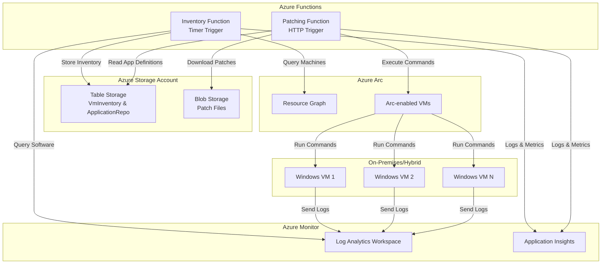

# Azure App Patching - Architecture

## Overview

The Azure App Patching solution provides automated inventory collection and patch deployment for 3rd party applications across Azure Arc-enabled virtual machines. The system uses a serverless, cloud-native architecture built on Azure Functions, Azure Arc, and Azure Storage.

## Architecture Diagram

## Core Components

### 1. Azure Functions

**Inventory Function**
- **Trigger**: Timer (every 6 hours)
- **Purpose**: Collect complete software inventory from all Arc-enabled VMs
- **Data Source**: Azure Resource Graph + Log Analytics Workspace
- **Output**: Stores all discovered applications in VM Inventory table

**Patching Function** 
- **Trigger**: HTTP POST
- **Purpose**: Deploy application patches to specific VMs via Arc run-command
- **Input**: VM name, software name, target version
- **Process**: Looks up installation command from Application Repository, executes via Arc

### 2. Table Storage Schema

**VmInventory Table**
- **PartitionKey**: VM Name
- **RowKey**: SoftwareName-DateTime
- **Data**: Complete software inventory (no filtering)
- **Retention**: 7 days of historical data

**ApplicationRepo Table**
- **PartitionKey**: Software Name  
- **RowKey**: Version
- **Data**: Installation commands, download URLs, vendor info
- **Purpose**: Define which applications support patching

### 3. Azure Arc Integration

**Resource Graph Queries**
- Discover all Arc-enabled machines across subscriptions
- Query machine properties (OS, status, location)
- Join with Azure Monitor data for software inventory

**Run Command Execution**
- Deploy patches via PowerShell scripts on target VMs
- Handle different installation types (system vs user)
- Support application-specific installation logic

### 4. Security & Authentication

**Managed Identity**
- System-assigned managed identity on Function App
- RBAC roles: Storage Table Data Contributor, Reader, Azure Connected Machine Resource Manager
- No stored credentials or connection strings

**Network Security**
- HTTPS-only communication
- TLS 1.2 minimum
- Private endpoints supported for storage and functions

## Data Flow

### Inventory Collection Flow

1. **Timer Trigger** activates Inventory Function every 6 hours
2. **Resource Graph Query** discovers all Arc-enabled VMs
3. **Monitor Query** retrieves software inventory from Log Analytics
4. **Data Processing** matches software to VMs, stores ALL applications
5. **Table Storage** persists complete inventory with timestamps
6. **Cleanup** removes inventory entries older than 7 days

### Patch Deployment Flow

1. **HTTP Request** triggers Patching Function with VM and software details
2. **Application Lookup** finds installation command in Application Repository
3. **Script Selection** chooses application-specific or generic installer script
4. **Arc Run Command** executes PowerShell script on target VM with parameters
5. **Progress Monitoring** waits for command completion and retrieves output
6. **Response** returns deployment status and results

## Scalability Considerations

**Function App Scaling**
- Consumption plan auto-scales based on load
- Timer functions run on single instance to avoid duplication
- HTTP functions scale out based on concurrent requests

**Table Storage Performance**
- Partition keys optimized for query patterns
- VM Name partitioning distributes load across storage partitions
- Continuation tokens handle large result sets

**Arc Run Command Limits**
- Maximum 5 concurrent run commands per VM
- 10-minute timeout per command execution
- Retry logic for transient failures

## Monitoring & Observability

**Application Insights**
- Function execution logs and metrics
- Custom telemetry for patch deployment success/failure rates
- Performance monitoring and alerting

**Log Analytics Integration**
- Centralized logging for all components
- Custom KQL queries for operational insights
- Integration with Azure Monitor alerts

## Extensibility Points

**New Application Support**
1. Add entry to Application Repository table with installation command
2. Optionally create application-specific PowerShell script
3. System automatically includes new app in patch deployment capabilities

**Custom Installation Logic**
1. Create PowerShell script in `/src/scripts/{appname}/`
2. Reference script path in Application Repository entry
3. Function automatically uses custom script for that application

**Additional Data Sources**
1. Extend Resource Graph queries for additional machine properties
2. Add new table entities for custom metadata
3. Modify inventory function to process additional data sources

## Disaster Recovery

**Backup Strategy**
- Table Storage has built-in geo-redundancy (GRS)
- Function code stored in Git repository
- Infrastructure defined as Bicep templates

**Recovery Procedures**
1. Redeploy infrastructure using Bicep templates
2. Deploy Function App code from repository
3. Table data automatically available due to GRS
4. Re-seed Application Repository if needed

## Cost Optimization

**Function App**
- Consumption plan charges only for execution time
- Timer functions run 4 times daily = minimal cost
- HTTP functions charge per request

**Storage Account**  
- Table Storage charged per operation and storage
- 7-day retention keeps storage costs low
- Blob storage for patches uses hot access tier

**Azure Arc**
- No additional charges for run command execution
- Existing Arc licensing covers patch management operations